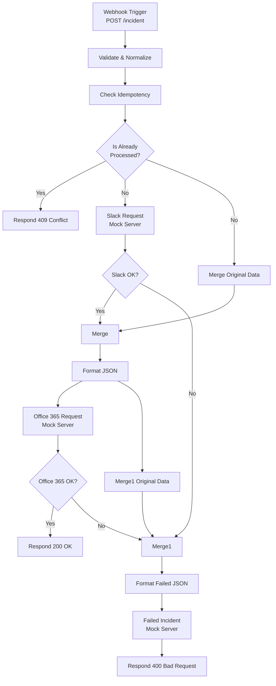

# n8n Offline Candidate Evaluation Kit

This project is an offline evaluation kit containing a mock incident management frontend, mock servers for external third-party services (Slack, Microsoft), and a pre-configured n8n workflow.

## Project Setup & Run Instructions

### 1. Root Project Setup
First, install the root dependencies which are required for the mock servers.
```bash
npm install
```

### 2. Start the Mock Servers
Start the mock servers for Slack, Microsoft Office 365, and Failure simulation:
```bash
npm run mocks
```
This will concurrently start services mimicking external APIs.

### 3. Frontend Setup & Run
The frontend is built with React and Vite. It serves an Incident Management application that sends webhooks to n8n.
```bash
cd frontend
npm install
npm run dev
```
The application will be accessible at the local Vite dev server port (typically http://localhost:5173).

### 4. n8n Workflow Setup
1. Launch your local or cloud n8n instance.
2. Import the workflow file located at `workflow/Offline Incident Notifier - Production.json`.
3. The workflow receives webhook requests on the `/incident` path.
4. **Publish the Workflow**: The workflow must be activated (toggled to "Active" in the top right) to handle requests sent to the production `webhook/incident` path.
5. **Testing Unpublished Workflows**: If you only want to test the workflow without publishing it, you need to change the POST URL from `/webhook/incident` to `/webhook-test/incident` inside the `frontend/src/api/incidentService.js` file.
6. Ensure your frontend application is sending requests to the correct n8n base URL on your machine. Update the `baseURL` in the frontend's API client (`frontend/src/api/apiClient.js`) if needed.

---

## Components Overview

### Mocks
Located in the `mocks/` directory. Mimic actual external APIs for safe offline testing without real API tokens.
- **Slack Mock**: Simulates Slack `chat.postMessage` endpoints (running on `http://localhost:4010`).
- **Microsoft Mock**: Simulates Office 365 mail sending endpoints (running on `http://localhost:4020`).
- **Failure Mock**: Simulates a failure aggregation endpoint (running on `http://localhost:4030`).

### Frontend Code
A single-page React application for triggering incidents.
- Built using React, Vite, Axios, and React Toastify.
- **`App.jsx`**: Features the main form to submit new incidents (fields include Incident ID, Severity, Title, Description, Owner Email, and Tags).
- **`api/incidentService.js`**: Dispatches the form payload to the n8n webhook endpoint via HTTP POST. Features basic loading and error states handled in the UI.

### n8n Workflow
The workflow (`Offline Incident Notifier - Production.json`) performs the following logic:
1. **Webhook Trigger**: Receives incoming requests on the `/incident` endpoint via POST.
2. **Data Validation**: Enforces required fields (`incidentId`, `severity`, `title`, `createdAt`) and normalizes severity payload.
3. **Idempotency/Deduplication**: Deduplicates incoming requests based on a combination key of `incidentId` + `createdAt`.
4. **Integration**: Sends an alert to the Slack mock channel (`#oncall-alerts`) and an email outline to the Office 365 mock server.
5. **Failure Handling**: If an incident fails to propagate or is flagged as unsuccessful, it reports the failure to the Failure mock (`/failed-incident`).
6. **Response**: Responds back to the frontend webhook origin depending on success, conflict, or failure condition codes (200, 400, 409).

#### Workflow Architecture Diagram



#### Detailed Node Understanding

- **Webhook Trigger**: Listens for HTTP POST requests at `/incident`. It parses the JSON payload to initiate the workflow.
- **Validate + Normalize**: Code node that verifies the presence of `incidentId`, `severity`, `title`, and `createdAt`. It maps P1-P4 severities to 1-4, truncates long descriptions to 240 chars, and constructs raw message definitions for Slack and Emails.
- **Check Idempotency**: Code node utilizing n8n's `global` static data to remember the `dedupeKey` (`incidentId_createdAt`). It returns an `alreadyProcessed` boolean flag.
- **If Nodes**: Direct the flow based on boolean conditions. For example, if a request is already processed, it routes to a 409 conflict webhook response.
- **External Requests**: Standard HTTP Request nodes submit the normalized payloads to the local simulated backend APIs for Slack and Office 365.
- **Error Handling & Merging**: Parallel paths use `Merge` nodes and conditional `If` nodes to handle failures dynamically. If Slack or Microsoft fails, the workflow elegantly aggregates the failures via `Merge1` and `Format json1` into a single consolidated payload. It then POSTs this to the Failure mock server, finally responding with an HTTP 400 Bad Request to the caller.

